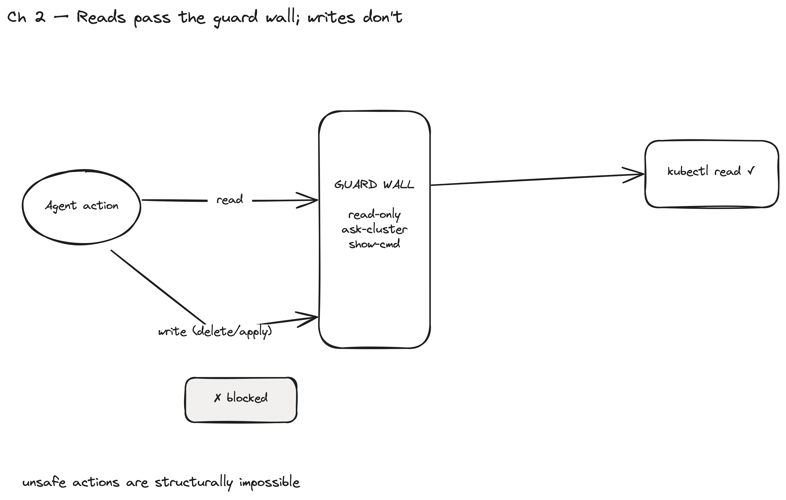

# Chapter 2 — Anatomy of a Safe SRE Agent Skill

> **Audit posture:** this chapter *builds* the guardrails the other chapters rely on.
> After it, unsafe actions are structurally impossible — not merely discouraged.

> Build the agent-skill scaffold — SKILL definition, activation routing, scripts,
> and steps — with the enterprise guardrails of **read-only-by-default access,
> ask-which-cluster, show-every-command, cluster guards, and an auditable path
> before any change reaches the platform.**



*Figure 2.1 — Reads pass the guard wall; writes (delete/apply) hit it and are blocked. Unsafe actions are structurally impossible — the model cannot talk its way around code.*

## What you build

The skill skeleton that every later capability plugs into — and, crucially, the
**guardrails as first-class code**, not prose. After this chapter the agent can
do exactly one thing (preflight), but it can never do the *wrong* thing.

## Why it matters (enterprise / audit / agentic)

Enterprises don't adopt an "autonomous" agent on a promise of good behaviour;
they adopt one whose unsafe actions are **structurally impossible**. So the
guardrails live in the scripts, where the model can't talk its way around them:

- **Read-only by default** — the `kube.py` wrapper allow-lists read verbs; a
  mutating verb raises a hard error. The model literally cannot issue `kubectl
  delete` through the skill.
- **Ask which cluster** — `prerequisites.enforce(cluster)` resolves the target
  (default `dev`, never the current context) and refuses an unknown one.
- **Show every command** — `kube.py` echoes each call to stderr before running it.
- **Cluster guard** — runs only against a context that exists in kubeconfig. There
  is no repo guard: the skill targets clusters, so it works for any org.
- **Auditable path** — established as the design rule here; realized in Chapter 5
  (changes go through a PR, never a live cluster).

This is the chapter that earns the word *governed*.

## What to start

Chapter 1's lab up; `python3`, `git`, `kubectl`, `talosctl` on PATH.

## How to do it — the scaffold (house style)

Mirror the shipped `reqsume-sre` / `huddle` skill shape (see `~/.claude/CLAUDE.md`):

```
.claude/skills/platform-sre/
├── SKILL.md                      # thin: frontmatter + Core Rules + "follow workflow.md"
├── README.md
├── install.sh
├── references/
│   ├── workflow.md               # Variables, Core Rules, numbered Process
│   ├── activation-routing.xml    # <defaults> + <routes>(<when>/<goal>/<steps>)
│   ├── talos-cheatsheet.md
│   └── steps/step-00-preflight.md … step-06-remediate.md
└── scripts/
    ├── prerequisites.py          # enforce(): binaries + cluster guard (resolve/default dev)
    ├── kube.py                   # read-only kubectl/talosctl wrappers + Findings
    └── <capability>.py           # one per chapter (Ch3–5)
```

Build order within the chapter:

1. **`scripts/prerequisites.py`** — the cornerstone guard. `enforce(cluster)`
   checks binaries and resolves the cluster (default `dev`, never the current
   context), refusing an unknown one. Every other script calls it first.
2. **`scripts/kube.py`** — the `Cluster` handle: `kubectl()`/`talosctl()` that
   *show* and *allow-list* every call, plus a `Findings` accumulator whose count
   becomes the script's exit code (so capabilities double as CI gates).
3. **`SKILL.md` + `references/`** — thin SKILL.md (triggers + Core Rules), the
   `workflow.md` process, the `activation-routing.xml` dispatcher, and one
   `steps/step-NN-*.md` per route.
4. **`steps/step-00-preflight.md`** — the runbook the agent reads first: pick a
   cluster, run `prerequisites.py`, fail-fast.

## What is what (artifact map)

| Path | Role |
|---|---|
| `scripts/prerequisites.py` | binaries + cluster guard / resolve+default-dev (`enforce()`) |
| `scripts/kube.py` | read-only command wrappers + `Findings` + `section()` |
| `SKILL.md` | activation triggers + the four Core Rules |
| `references/workflow.md` | variables + process (read steps in order) |
| `references/activation-routing.xml` | route table: `<when>` triggers → step file |
| `references/steps/step-00-preflight.md` | the safe entry runbook |

## Verify the guardrails actually bite

```bash
# cluster guard: refuses an unknown context, lists the real ones
python3 .../scripts/prerequisites.py --cluster nope       # → "unknown cluster 'nope'"
# default-dev: no --cluster resolves to dev, never the current context
python3 .../scripts/prerequisites.py                      # → "defaulting to 'admin@dev'"
# read-only guard (unit-level): kube.py refuses a non-read verb → hard error
```

## Status (built vs stubbed)

- **Built & verified:** `prerequisites.py` (repo + binary + cluster guards) and
  `kube.py` (read-only wrappers + Findings) are in place; the full `references/`
  scaffold (workflow, activation-routing, 7 step files, cheatsheet) is written.
- The guardrails are exercised by every Chapter 3–5 capability.
