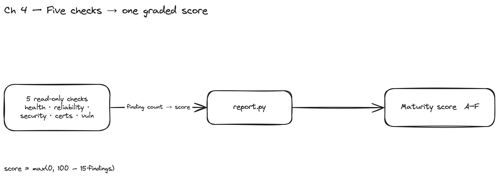

# Chapter 4 — Security, Certs & the Platform Maturity Report

> **Audit posture:** read-only · blast radius = **zero** · every command is shown.
> These capabilities *assess*; they change nothing. The maturity report is the
> chapter's headline artifact — an evidence-backed scorecard, not an opinion.

> Two new assessments — **security drift** and **certificate-expiry-as-outage** —
> and then the **capstone**: a scored Platform Maturity Report that aggregates
> everything the agent has learned so far.



*Figure 4.1 — Five read-only checks collapse into one graded score: each finding count feeds `report.py`, which grades the platform A–F. Every number traces back to a shown command.*

## What you build

- `security_drift.py` — privileged containers, runAsRoot, hostPath/hostNetwork,
  namespaces with no NetworkPolicy.
- `certs.py` — kube + apiserver cert expiry → **predicted API outage window**.
- `report.py` — the capstone. Runs health + reliability + security + certs, turns
  each dimension's finding count into a 0–100 score, prints a graded report.

```
report ← { health.py, reliability.py, security_drift.py, certs.py }
```

`report.py` is **not** a third sibling capability — it is the synthesis of Ch1–4.
The chapter doc should draw that dependency explicitly so a reader sees the
aggregation, not three unrelated tools.

## Why it matters (enterprise / audit / agentic)

- **Cert expiry is an outage predictor, not paperwork.** Talos PKI is short-lived by
  design; an expired control-plane cert takes the API server down. `certs.py` turns
  "days remaining" into a predicted outage window — the kind of forward-looking
  signal an enterprise platform team is actually accountable for.
- **Security drift is posture, scored honestly.** Privileged + root are high
  severity; a namespace with no NetworkPolicy is a posture gap. The report weights
  them and shows its math (−N per finding), so the score is *defensible to an
  auditor*, not a black box.
- **The scorecard is the executive artifact.** `Security 85 / Reliability 60 / …`
  is what a platform lead takes into a review. Because every number traces back to a
  shown command, the agent's claim survives scrutiny.

## What to start

Chapter 1 lab up; Chapter 3 fault workloads deployed. To make the privileged/hostPath
drift actually *run* (Talos enforces PodSecurity `baseline` cluster-wide), the `demo`
namespace is labelled `pod-security.kubernetes.io/enforce: privileged` in
`fault-workloads.yaml` — relaxing PSA is itself a realistic security finding.

## How to do it

```bash
python3 .claude/skills/platform-sre/scripts/security_drift.py --cluster admin@dev
python3 .claude/skills/platform-sre/scripts/certs.py          --cluster admin@ops --threshold-days 30
python3 .claude/skills/platform-sre/scripts/report.py         --cluster admin@dev
```

Implementation notes:

- `security_drift.py` reasons over **running pods** (`kubectl get pods -A -o json`).
  If PodSecurity blocks a privileged pod, there's nothing running to find — hence the
  namespace-level PSA relaxation in the lab so the drift is real. (A v2 check can also
  flag the relaxed-PSA label itself.)
- `certs.py` reads the kubeconfig client cert and the live apiserver serving cert via
  `openssl`, computes days-to-expiry, and prints the earliest failure as the outage
  window. `--threshold-days` controls the finding cutoff.
- `report.py` shells the four capability scripts, reads their exit codes as finding
  counts, scores `max(0, 100 − 15·findings)` per dimension, and grades A–F. It always
  exits 0 — it's a report, not a gate.

## What is what (artifact map)

| Path | Role |
|---|---|
| `.claude/skills/platform-sre/scripts/security_drift.py` | security posture scan |
| `.claude/skills/platform-sre/scripts/certs.py` | cert expiry → outage prediction |
| `.claude/skills/platform-sre/scripts/report.py` | **capstone**: scored maturity report |
| `.claude/skills/platform-sre/references/step-03-security.md` | security runbook |
| `.claude/skills/platform-sre/references/step-04-certs.md` | certs runbook |
| `.claude/skills/platform-sre/references/step-05-report.md` | report runbook |

## Verify (observed / expected on the live lab)

- `security_drift.py --cluster admin@dev` → finds `demo/web` runAsNonRoot not
  enforced + `demo` namespace 0 NetworkPolicies (and, once the privileged `cache` pod
  runs, `demo/cache` privileged + hostPath).
- `certs.py --cluster admin@ops` → fresh lab certs are far from expiry → 0 findings,
  prints "no cert-driven outage within 30 days".
- `report.py --cluster admin@dev` → graded scorecard with Reliability the
  weakest dimension (the fault workloads), Operations/Certificates at 100.

## Status (built vs verified)

- **Built & verified:** `security_drift.py` (NetworkPolicy + runAsNonRoot findings
  confirmed live), `certs.py`, `report.py` (aggregates and grades).
- **Note:** privileged-pod detection requires the `demo` namespace PSA relaxation in
  the lab manifest (committed) so the privileged pod actually schedules.
