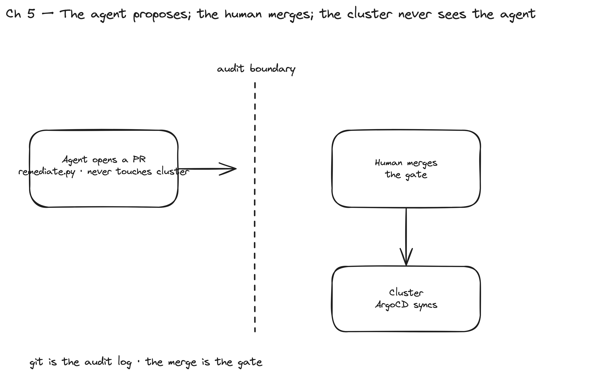

# Chapter 5 — GitOps & Autonomous Remediation

> **The audit boundary lives here.** This is the only chapter with a write path —
> and the agent **never touches the cluster**. It opens a **pull request**; a human
> **merges**; **ArgoCD** reconciles the merged state onto the platform. Detect → PR →
> review → sync. The merge is the audit gate; git is the audit log.

> Everything before this was read-only assessment. Now the agent closes the loop —
> safely — by proposing fixes the same way a human teammate would: as a reviewable
> change in version control, not a live `kubectl apply`.



*Figure 5.1 — The remediation loop. The agent detects a finding and opens a PR; it never touches the cluster. A human merges (the audit gate) and ArgoCD reconciles. Git is the audit log; the merge is the gate.*

## What you build

- The GitOps hub on `ops`: **ArgoCD** + an in-cluster **Gitea** holding the
  `platform` repo (App-of-Apps + ApplicationSets that fan platform components onto
  the workload clusters).
- `remediate.py` — detect a finding → generate a fix manifest → branch + commit +
  push to Gitea → **open a PR**. Dry-run by default; `--apply` required to push.

## Why it matters (enterprise / audit / agentic)

- **No autonomous write to production — by construction.** The agent's most
  "autonomous" act produces a *proposal*, not a mutation. The change reaches the
  platform only after a human merges. This is the single property that makes an
  enterprise comfortable letting an agent near their clusters.
- **GitOps is the audit trail.** Who proposed it, what it changes, who approved it,
  when it synced — all in git + ArgoCD history. Nothing to reconstruct after an
  incident.
- **`ask-which-cluster` is the prod-safety control.** The same patterns extend from
  one cluster to staging, production, and a **fleet** — and the guard that keeps that
  safe is the no-default cluster prompt: the agent cannot act on prod when it meant
  dev.

## What to start

Chapter 1 lab up; run the hub + registration scripts (idempotent):

```bash
spikes/talos-gitops/scripts/02-connect-networks.sh    # hub↔spoke routing
spikes/talos-gitops/scripts/03-bootstrap-hub.sh       # ArgoCD + Gitea + seed platform repo + root-app
spikes/talos-gitops/scripts/04-register-clusters.sh   # register workloads in ArgoCD (insecure TLS, env=workload)
```

## How to do it

```bash
# 1. open the Gitea tunnel (shown first; left running in another shell)
kubectl --context admin@ops -n gitea port-forward svc/gitea-http 3000:3000

# 2. PREVIEW the fix (dry-run — prints manifest + planned git/PR commands, changes nothing)
python3 .claude/skills/platform-sre/scripts/remediate.py \
  --cluster admin@dev --fix missing-pdb --namespace demo --workload web

# 3. APPLY (opens the PR — still no cluster mutation)
python3 .claude/skills/platform-sre/scripts/remediate.py \
  --cluster admin@dev --fix missing-pdb --namespace demo --workload web --apply
```

Then a human reviews + merges the PR; ArgoCD syncs the PDB onto the workload cluster.

Implementation notes:

- `remediate.py` is the **only** script that mutates state, and it mutates **git**.
  It generates the manifest into `gitops/apps/remediation/…`, pushes a branch, and
  opens a PR via the Gitea API. Dry-run unless `--apply`.
- MVP fix set = `missing-pdb` (a `PodDisruptionBudget` for a single-replica workload —
  the headline reliability finding from Chapter 3). Extend by adding a generator to
  `FIXES` in `remediate.py`; probe/securityContext patches are the documented v2.
- The hub's GitOps content (`gitops/bootstrap/root-app.yaml` + `gitops/apps/*`) is the
  App-of-Apps pattern: ArgoCD syncs the root, which renders the ApplicationSets that
  deploy ingress-nginx / cert-manager / metrics-server / kube-prometheus-stack onto
  every cluster labelled `environment=workload`.

## What is what (artifact map)

| Path | Role |
|---|---|
| `spikes/talos-gitops/scripts/03-bootstrap-hub.sh` | install ArgoCD + Gitea, seed the platform repo, apply root-app |
| `spikes/talos-gitops/scripts/04-register-clusters.sh` | register workload clusters in ArgoCD |
| `spikes/talos-gitops/gitops/bootstrap/root-app.yaml` | App-of-Apps root |
| `spikes/talos-gitops/gitops/apps/*.yaml` | ApplicationSets (the platform components) |
| `.claude/skills/platform-sre/scripts/remediate.py` | detect → PR → (merge) → ArgoCD |
| `.claude/skills/platform-sre/references/step-06-remediate.md` | remediation runbook + safety model |

## Verify

- ArgoCD + Gitea Running on `ops`; the `platform` repo seeded; `platform-root`
  Application present in `argocd`.
- Workloads registered: `kubectl --context admin@ops -n argocd get secret -l
  argocd.argoproj.io/secret-type=cluster` shows `cluster-dev/staging/prod`.
- ApplicationSets generate one Application per workload cluster; they sync
  ingress-nginx / cert-manager / metrics-server / kube-prometheus-stack.
- `remediate.py … ` (dry-run) prints the PDB manifest + planned commands; `--apply`
  opens a PR in Gitea.

## Status (built vs stubbed)

- **Built:** hub scripts (`03`/`04`), GitOps manifests, `remediate.py`
  (dry-run + `--apply`, MVP `missing-pdb`).
- **Verify-on-wake:** `03` hub bootstrap completed; `04` registration + ArgoCD app
  sync to be confirmed live (see the run STATUS doc).
- **v2 (deferred):** more `--fix` generators, cert rotation, multi-cluster/fleet
  report fan-out.
